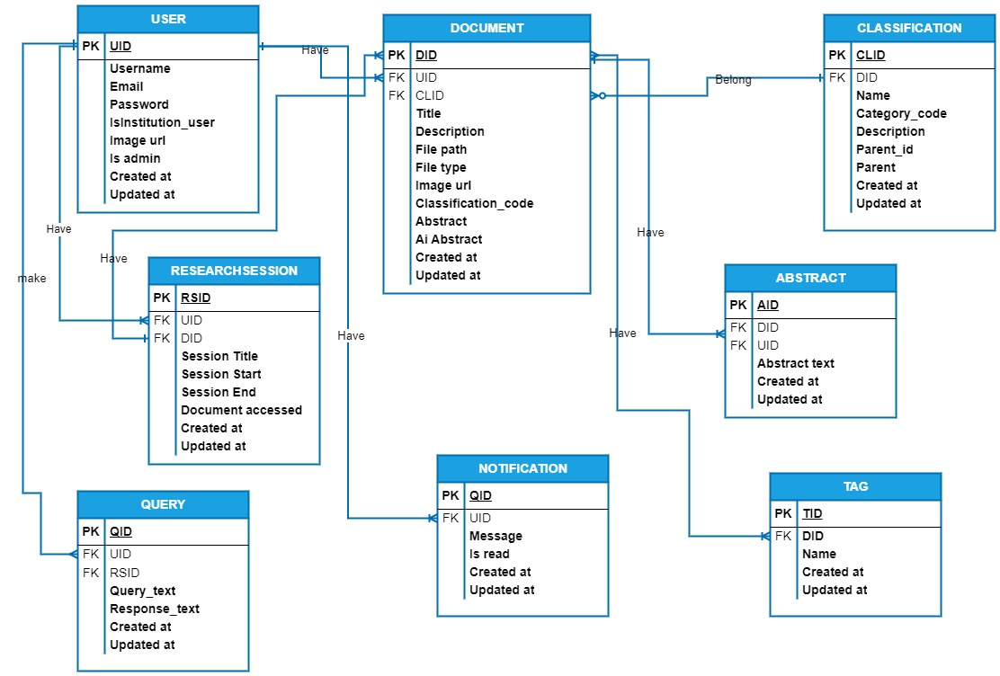

# Library_Aid
Library Aid application is a smart, scalable, and  user-friendly personal library management  system that combines traditional library  principles with AI technology. It aims to  empower users to efficiently organize, explore,  and interact with their personal libraries,  ultimately fostering a more productive and  insightful research experience.

## Table of Content
* [Environment](#environment)
* [Installation](#installation)
* [Usage](#usage)
* [Models](#models)
* [Authors](#authors)
* [License](#license)

## Environment
This project is developed using Python 3.11 and the required packages are listed in the `requirements.txt` file.

## Installation
* Clone the repository to your local machine from the GitHub repository: "git clone https://github.com/MarvelousMarvin7/Library_Aid.git"
* Create a virtual environment using the following command: "python -m venv venv"
* Install the required packages using the following command: "pip install -r requirements.txt"
* Access the project directory: "cd Library_Aid"
## Usage
* You can create a test data in your mysql database from `main_document.py` file by running this command on your command line:
    - for powershell:
    ```
    $env:LIAID_MYSQL_USER="liaid_dev"; $env:LIAID_MYSQL_PWD="liaid_dev_pwd"; $env:LIAID_MYSQL_HOST="localhost"; $env:LIAID_MYSQL_DB="liaid_dev_db"; $env:LIAID_TYPE_STORAGE="db"; python ./main_document.py
    ```
    - for cmd:
    ```
    set LIAID_MYSQL_USER=liaid_dev && set LIAID_MYSQL_PWD=liaid_dev_pwd && set LIAID_MYSQL_HOST=localhost && set LIAID_MYSQL_DB=liaid_dev_db && set LIAID_TYPE_STORAGE=db && python ./main_document.py
    ```
    - for linux:
    ```
    vagrant/Library_Aid$ LIAD_MYSQL_USER=liaid_dev LIAD_MYSQL_PWD=liaid_dev_pwd LIAD_MYSQL_HOST=localhost LIAD_MYSQL_DB=liaid_dev_db LIAD_TYPE_STORAGE=db python3 ./main_document.py
    ```
* Create a `.env` file in the root directory and add the following environment variables
    ```
    LIAID_MYSQL_USER=<your_mysql_user>
    LIAID_MYSQL_PWD=<your_mysql_password>
    LIAID_MYSQL_HOST=<your_mysql_host>
    LIAID_MYSQL_DB=<your_mysql_database>
    LIAID_TYPE_STORAGE=<your_storage_type, example 'db'>
    LIAID_API_HOST=<your_api_host, use '0.0.0.0'>
    LIAID_API_PORT=<your_api_port, use '5000'>
    LIAID_JWT_SECRET_KEY=<your_jwt_secret_key>
    ```
* Run the application using the following command: "python app.app" or use the following command in the command line
    - for powershell:
    ```
    $env:LIAID_MYSQL_USER="<your_mysql_user>"; $env:LIAID_MYSQL_PWD="<your_password>"; $env:LIAID_MYSQL_HOST="<your_host>"; $env:LIAID_MYSQL_DB="<your_database>"; $env:LIAID_TYPE_STORAGE="<your_db>"; $env:LIAID_API_HOST="0.0.0.0"; $env:LIAID_API_PORT="5000"; $env:LIAID_JWT_SECRET_KEY="<your_jwt_secret_key>"; python3 -m app.app
    ```
    - for cmd:
    ```
    set LIAID_MYSQL_USER=<your_mysql_user> && set LIAID_MYSQL_PWD=<your_password> && set LIAID_MYSQL_HOST=<your_host> && set LIAID_MYSQL_DB=<your_database> && set LIAID_TYPE_STORAGE=<your_db> && set LIAID_API_HOST=<your_api_host> && set LIAID_API_PORT=<your_api_port> && set LIAID_JWT_SECRET_KEY=<your_jwt_secret_key> && python -m app.app
    ```
    - for linux:
    ```
    LIAD_MYSQL_USER=<your_mysql_user> LIAD_MYSQL_PWD=<your_password> LIAD_MYSQL_HOST=<your_host> LIAD_MYSQL_DB=<your_database> LIAD_TYPE_STORAGE=<your_db> LIAD_API_HOST=<your_api_host> LIAD_API_PORT=<your_api_port> LIAD_JWT_SECRET_KEY=<your_jwt_secret_key> python3 -m app.app
    ```
* To test the api endpoints from swagger-UI, visit `http://127.0.0.1:5000/apidocs/.` in your browser after running the application.
* Or you can test with
    - Example of a POST request:
    ```
    curl -X POST http://localhost:5000/api/signin -H "COntent-Type: application/json" -d '{"email":"test1@gmail.com", "password":"testpwd"}'
    ```
* Note that signing in will give you an access token which you can use to access other endpoints.

## Models
* This is an image showing the `Entity relationship` between all models


## Authors
* Marvin Agyei - [Github](https://github.com/MarvelousMarvin7/Library_Aid.git) / [Email](mailto:marvinagyei3@gmail.com)

## License
Public Domain. No copy write protection.
